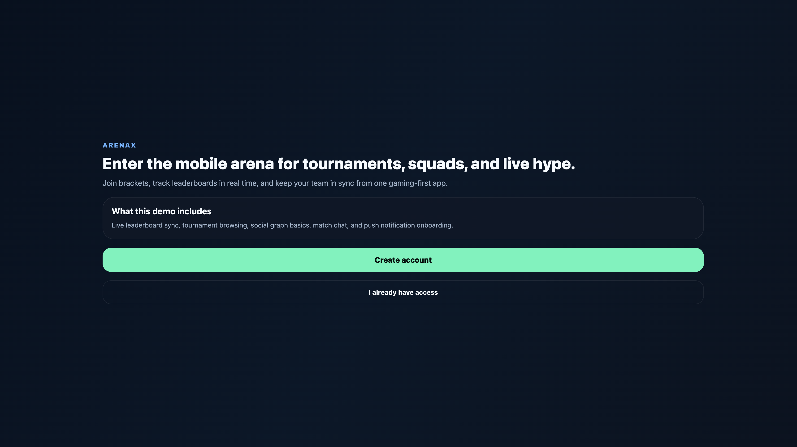
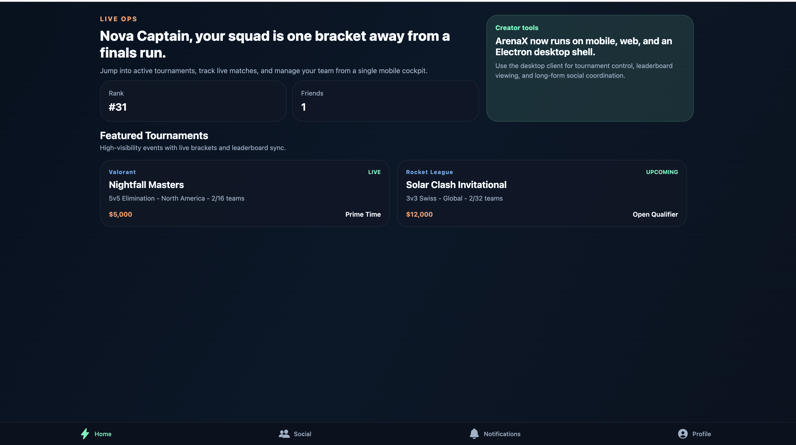
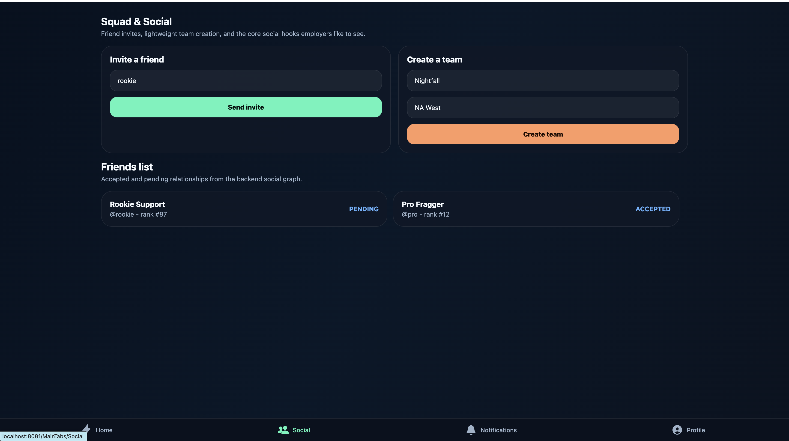
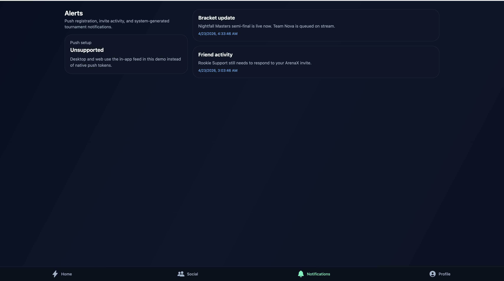
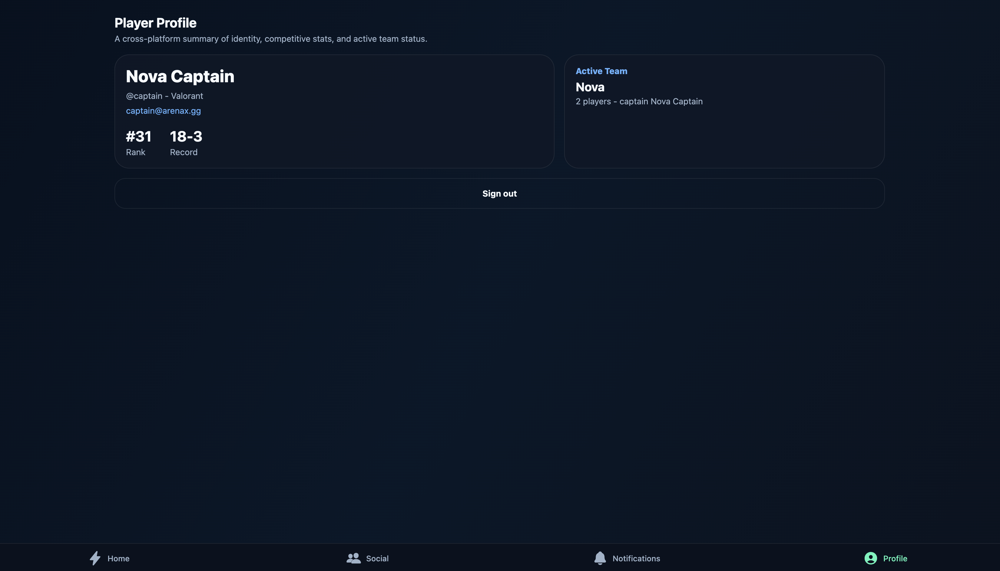

# ArenaX

ArenaX is a cross-platform esports tournament and social platform built as a full-stack monorepo. The project pairs an Expo + React Native client for iOS, Android, and web with an Electron desktop shell, plus a Java Spring Boot backend, PostgreSQL persistence, WebSocket-powered live updates, and Docker-based local infrastructure.

## What is included

- Mobile-first tournament discovery, bracket viewing, live leaderboard, team chat, profile, and friends flows
- Desktop shell support for larger-screen tournament viewing and social coordination
- Spring Boot REST APIs for auth, tournaments, teams, chat, notifications, and social actions
- STOMP/WebSocket broadcasting for leaderboard and match chat updates
- PostgreSQL-backed domain models for players, teams, tournaments, matches, and friendships
- Push notification token registration pipeline prepared for Firebase Cloud Messaging
- Docker Compose for database + backend startup
- GitHub Actions CI scaffold for mobile lint/type checks and backend tests

## Repository layout

```text
ArenaX/
  desktop/       Electron desktop shell
  mobile/        Expo React Native application
  backend/       Spring Boot API
  .github/       CI workflows
```

## Core product flows

1. Players create an account and land on a gaming-style dashboard of active tournaments.
2. Users can inspect brackets, leaderboard standings, and team rosters in real time.
3. Team captains can create teams, invite players, and register for tournaments.
4. Players can manage friends, send invites, and join match chat rooms.
5. The backend publishes match and leaderboard updates over WebSockets so the mobile app can react instantly.

## Screenshots

### Welcome screen

New-user landing experience that introduces ArenaX as a tournament, squad, and live leaderboard platform.



### Home dashboard

Signed-in home view showing featured tournaments, player rank, friends count, and the desktop-ready product framing.



### Squad and social

Social workspace for friend invites, lightweight team creation, and visibility into accepted and pending player relationships.



### Notifications feed

In-app alerts center for bracket updates, friend activity, and device notification status across platforms.



### Player profile

Profile summary showing player identity, competitive record, and active team information in one cross-platform view.



## Mobile stack

- React Native with Expo
- TypeScript
- React Navigation
- Zustand
- TanStack Query with offline persistence
- Expo Notifications
- STOMP over WebSockets

## Desktop stack

- Electron shell loading the Expo web client
- Shared React Native codebase with responsive layouts for larger screens

## Backend stack

- Java 21+ / Spring Boot
- Spring Security with JWT auth
- Spring Data JPA
- PostgreSQL
- Spring WebSocket
- Docker

## Local setup

### 1. Copy env values

Create a `.env` file at the repo root using `.env.example`.

### 2. Install dependencies

```bash
npm install
npm --prefix mobile install
```

### 3. Start infrastructure

```bash
docker compose up --build
```

This starts PostgreSQL and the Spring Boot backend on port `8080`.

Keep Docker Desktop running while the backend is up.

### 4. Run the mobile app

```bash
cd mobile
npm run start
```

If you run the Expo app on a physical device, point `EXPO_PUBLIC_API_BASE_URL` and `EXPO_PUBLIC_WS_BASE_URL` at your machine's LAN IP instead of `localhost`.

### 5. Run the desktop app

From the repo root:

```bash
npm run dev:desktop
```

That starts the Expo web client on port `19006` and opens the Electron desktop shell.

### One-command full-stack dev modes

Web client + backend:

```bash
npm run dev:full:web
```

Desktop client + backend:

```bash
npm run dev:full:desktop
```

### 6. Run the backend without Docker

If Maven is installed locally:

```bash
cd backend
mvn spring-boot:run
```

## Demo credentials

Seed data creates these sample users:

- `captain@arenax.gg` / `password123`
- `pro@arenax.gg` / `password123`
- `rookie@arenax.gg` / `password123`
- `admin@arenax.gg` / `password123`

## Resume-ready bullets

Adjust the metrics to match your real usage before you put these on a resume:

- Developed ArenaX, a cross-platform React Native esports application for iOS, Android, web, and desktop enabling tournaments, team creation, friend invites, and match chat through shared real-time social competition flows.
- Architected and deployed Spring Boot services with PostgreSQL, WebSockets, Docker, and CI pipelines powering live leaderboards, notifications, and seamless multi-device gameplay updates.

## Notes

- Firebase server credentials are not committed; the app currently registers device tokens on iOS and Android and falls back to in-app notifications on desktop and web.
- The backend codebase is scaffolded for extension into admin tools, moderation, analytics, and more advanced matchmaking.
